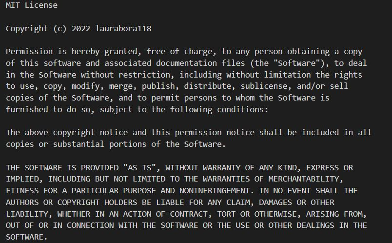

# Porfolio
Laura Sandura Portfolio

Main Objective: 
A single-page react application portfolio to be able to share my work and showcase to potential employers.

Assignment Example 1 Picture:    
    

Assignment Example 2 Picture:
    

Assignment Example 3 Picture:
    

Assignment Example 4 Picture:
    

Git Repository link where finalzed project can be pulled:
    https://github.com/laurabora118/ls

Git Page that shows finalized project results:
    https://laurabora118.github.io/ls

References:
    1 - Original expectations received in UofA bootcamp assignments where the react lessons were utilized to help accomplish and also refactored code to create portfolio

MIT License:
    
